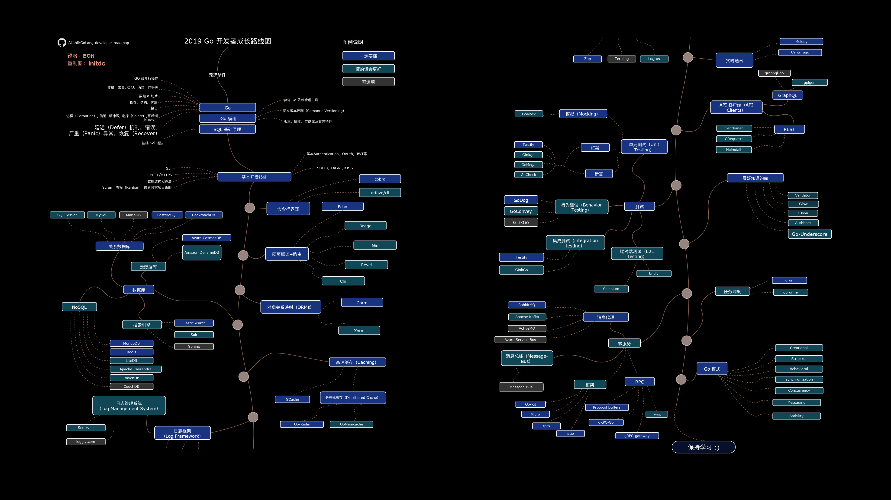
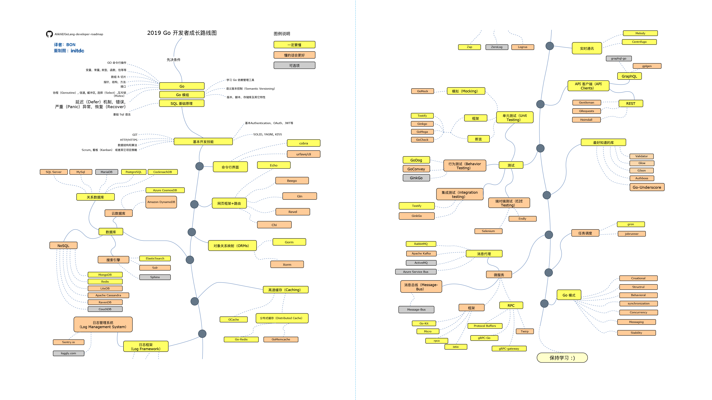

# Go  开发路线图 重制版壁纸
> 把开发路线图变成壁纸, 耳濡(rú)目染

--------

壁纸选择了 [BON](https://github.com/Quorafind) 翻译的中文路线图制作.

英文路线图仓库 [Alikhll/golang-developer-roadmap](https://github.com/Alikhll/golang-developer-roadmap)

中文路线图仓库 [Quorafind/golang-developer-roadmap-cn](https://github.com/Quorafind/golang-developer-roadmap-cn)

--------

## 壁纸

## 制作流程
> 给想要制作其他路线图壁纸的人

- 打开 [draw.io](https://www.draw.io/) 导入路线图仓库中的.xml文件, 导出成.html文件

- 用Chrome浏览器打开.html文件, 打印(Ctrl + P), 更多设置, 选择页面大小 **A2** , 去掉页眉页尾, 保存为.pdf

- 用 **Ps** 打开本仓库的 [resize.psd](./resize.psd), 准备替换图层中的 **矢量智能对象** ,

- 用 **Ai** 打开.pdf, 删掉多余的元素和边框, 复制, 到 Ps 中粘贴, 选择 **智能对象** 确定, Ctrl + T 调整到合适大小, 作为左侧部分, 复制该 **矢量智能对象** , 调整到右侧合适位置, 作为右侧部分.

## 更新

因为上游仓库的更新, 壁纸可能不能及时更新.

如有路线图中的技术更新建议, 请PR或Issue上游仓库.

## License

